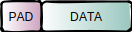
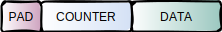
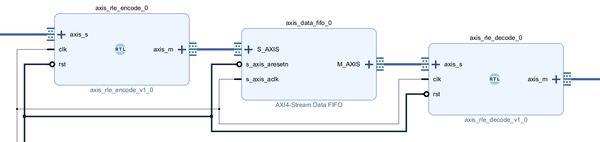

# axis_rle - AXI4-Stream run-length encoding
[](https://github.com/loecke/axis_rle/actions)

## Provided Entities
* axis_rle_encode --> *Encode an AXI4-Stream*
* axis_rle_decode --> *Decode an AXI4-Stream*


## Data Packing
### Raw / Decoded Stream



Data is contained in the lower bits of the tdata-signal.
If the data width is not a multiple of 8, the tdata-signal will contain padding at the upper bits.

### Encoded Stream



Data is contained in the lower bits of the tdata-signal.
The counter field is contained at the following bits with no padding in between.
If the sum of data width and counter width is not a multiple of 8, the tdata-signal will contain padding at the upper bits.


## Example Instantiations
### Encoding Module
```vhdl
encoding_inst : entity axis_rle.axis_rle_encode
  generic map(
    SYMBOL_WIDTH  => SYMBOL_WIDTH,
    COUNTER_WIDTH => COUNTER_WIDTH
  )
  port map(
    clk           => clk,
    rst           => rst,
    axis_s_tdata  => axis_s_tdata,
    axis_s_tvalid => axis_s_tvalid,
    axis_s_tready => axis_s_tready,
    axis_s_tlast  => axis_s_tlast,
    axis_m_tdata  => axis_m_tdata,
    axis_m_tvalid => axis_m_tvalid,
    axis_m_tready => axis_m_tready,
    axis_m_tlast  => axis_m_tlast
  );
```

### Decoding Module
```vhdl
decoding_inst : entity axis_rle.axis_rle_decode
  generic map(
    SYMBOL_WIDTH  => SYMBOL_WIDTH,
    COUNTER_WIDTH => COUNTER_WIDTH
  )
  port map(
    clk           => clk,
    rst           => rst,
    axis_s_tdata  => axis_s_tdata,
    axis_s_tvalid => axis_s_tvalid,
    axis_s_tready => axis_s_tready,
    axis_s_tlast  => axis_s_tlast,
    axis_m_tdata  => axis_m_tdata,
    axis_m_tvalid => axis_m_tvalid,
    axis_m_tready => axis_m_tready,
    axis_m_tlast  => axis_m_tlast
  );
```


## Example in Vivado Block Design

Add the axis_rle_encode.vhd and axis_decode.vhd to your Vivado Project.
In a Block Design use *Right-Click -> Add Module* and select the module(s) to use.
Data and counter widths can be set when double-clicking a module.


